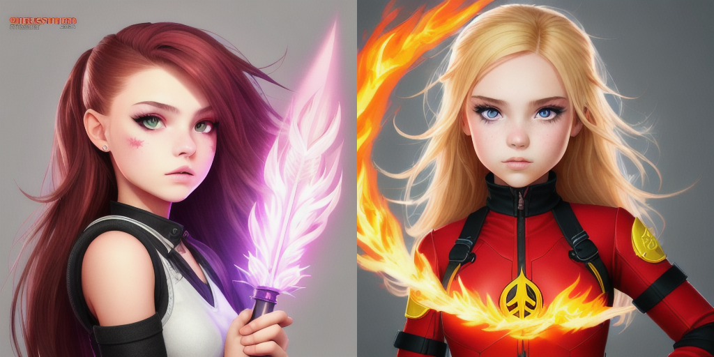

# Multimediagenerierung mittels Künstliche Intelligenz: Schülerworkshop

  

## Motivation

1. Keine AI-Literacy: Viele Menschen haben nur ein grundlegendes Verständnis von KI und sind sich der potenziellen Risiken und Vorteile dieser Technologie nicht bewusst.
2. Kein Interesse an MINT-Fächern: Viele junge Menschen interessieren sich nicht für MINT-Fächer, wie Informatik, Mathematik und Naturwissenschaften. Dies hat zur Folge, dass es einen Fachkräftemangel in diesen Bereichen gibt.
3. Diskrepanz zwischen Nutzung von KI in der Arbeitswelt und Schule/Bildung: In der Arbeitswelt wird KI bereits in vielen Bereichen eingesetzt. In der Schule und in der Bildung wird KI hingegen noch wenig eingesetzt. Dies führt dazu, dass junge Menschen nicht die Fähigkeiten und Kenntnisse erwerben, die sie benötigen, um in einer von KI geprägten Arbeitswelt erfolgreich zu sein.

## Verwendete Tools

Für die Erstellung dieses Workshops habe ich mit folgenden Tools gearbeitet:

- **Python** as main programming language
- **diffusers**-Bibliothek für die Inferenz von Diffusionsmodellen zur Generierung von Bildern aus benutzerdefinierten Prompts
- **transformers**-Bibliothek zum Herunterladen, Manipulieren und Ausführen von vortrainierten, Open-Source-AI-Modellen
- **PyTorch**-Bibliothek, um diese AI-Modelle nutzen zu können

## Infrastruktur zur Workshopdurchführung

Für diesen Workshop ist ein Google Account erforderlich. Zum Codeausführung wird Google Colab, auch bekannt als Google Colaboratory benutzt. Es ist eine Cloud-basierte Plattform von Google, die es Benutzern ermöglicht, Python-Notebooks auszuführen und zu teilen.

**Wichtig!** Eine detaillierte Anleitung, wie die Dateien in Google Colab gestartet werden können, sowie der Quellcode zur Erstellung von Multimedia finden Sie in der [Anleitung](ANLEITUNG_4.pdf). Hier wird lediglich eine kurze Übersicht des Workshops präsentiert.

## Bildgenerierung

Für die Bildergenerierung müssen die entsprechenden Eingabedaten in das Formular eingegeben werden: ein positiver Prompt, ein negativer Prompt, die "Orientierungsskala" sowie die Anzahl der Schritte (eine Beschreibung jeder Kategorie finden Sie im beigefügten [Anleitung](ANLEITUNG_4.pdf), p. 6.2).

Hier sind einige Beispiele gute Prompts:

1. [superpower], teenager girl, super power, drawing, artwork, fantasy hero character portrait \*(z.B. Firestarter, Plant Whisperer, Wind Rider usw.)

2. steampunk city, christmas, sunset, photorealism, from above

3. japan street, night, raining, moonlight, high detail, anime style

4. mystical forest, vibrant colors, towering trees

5. dramatic battle between elemental forces, with fire, water, earth, and air colliding in a mesmerizing display of power and energy

## Sprachgenerierung, Musikgenerierung und Videogenerierung

Die Generierung von Musik und Videos erfolgt auf ähnliche Weise, und Details können ebenfalls im beigefügten [Anleitung](ANLEITUNG_4.pdf), pp. 7.2, 8.2 und 9.2) nachgelesen werden.
Diese Teile des Workshops wurden von einer anderen Person erstellt, weshalb sie hier nicht präsentiert werden.

## Fazit

Im Rahmen dieses Schülerworkshops haben die Teilnehmerinnen und Teilnehmer die Möglichkeit, sich mit verschiedenen KI-Modellen vertraut zu machen. Dabei haben sie die Gelegenheit, die Potenziale und Risiken von KI kennenzulernen und sich eigene Gedanken zu den möglichen Anwendungen zu machen.
